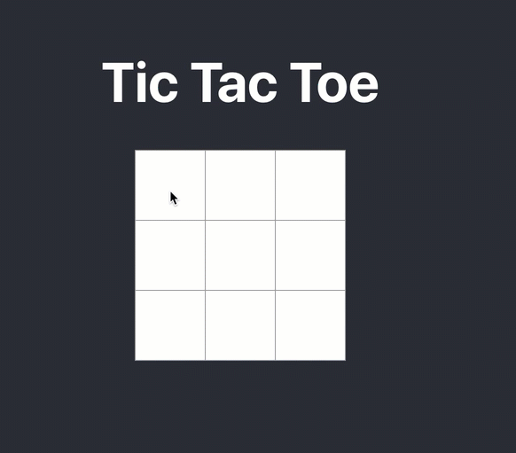

# Getting Started with Games using React

This project was bootstrapped with [Create React App](https://github.com/facebook/create-react-app).

## Learn More

Getting started with react: https://www.youtube.com/watch?v=iE2riYcRUDQ

## Available Scripts

In the project directory, you can run:

### `npm start`

Runs the app in the development mode.\
Open [http://localhost:3000](http://localhost:3000) to view it in the browser.

The page will reload if you make edits.\
You will also see any lint errors in the console.

## Game 1: Tic Tac Toe

Working Demo: https://engineerchirag.github.io/react-games/

Find me on Twitter, LinkedIn, Facebook, or any social platform @engineerchirag.
Author: [Chirag Goel](http://www.engineerchirag.in)
